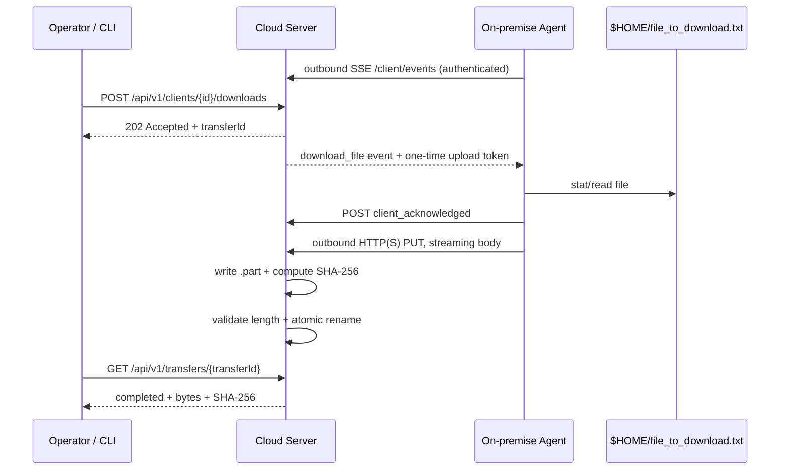

# Silentmode Software Engineer – Home Assignment

**Candidate:** Iswandi Saputra  
**Approach:** server-triggered reverse-pull using an outbound **SSE control channel** and outbound **HTTP(S) streaming data channel**.

## 1. Problem analysis

The cloud server must retrieve an approximately 100 MB file from an on-premise client that is inside a private LAN and is not directly reachable from the public internet. The file is expected at:

```text
$HOME/file_to_download.txt
```

A direct cloud-server → client TCP connection is therefore not a reliable design because NAT/firewall policy usually blocks unsolicited inbound connections.

The solution reverses the **network connection direction** while preserving the **logical ownership** of the operation:

1. Each on-premise agent opens an outbound persistent connection to the cloud server.
2. The cloud server records which clients are currently connected.
3. An operator triggers a download through an API or CLI command.
4. The server pushes a `download_file` command to that client's existing control connection.
5. The client opens a separate outbound HTTP(S) `PUT` and streams the local file to a one-time server endpoint.
6. The server streams the bytes directly to storage and marks the transfer complete.

Both client-side connections are outbound, so no port forwarding or public IP is required at the restaurant/site.

## 2. Architecture



### Why separate control and data planes?

**SSE control plane** carries only small commands and presence/heartbeat traffic.  
**HTTP(S) data plane** carries the 100 MB file using normal streaming/backpressure.

This avoids placing a large binary payload on the control connection and gives a clean migration path to direct multipart object-storage uploads in production.

SSE is sufficient here because command flow is primarily server → client. If the product later needs frequent bidirectional messages, WebSocket or MQTT can replace SSE without changing the file-transfer data plane.

## 3. Requirements mapping

| Requirement | Implementation |
|---|---|
| Retrieve from private on-premise client | Client initiates persistent outbound SSE; server pushes on-demand command; client streams file back outbound |
| Server triggers via API or CLI | `POST /api/v1/clients/:clientId/downloads` and `npm run trigger -- restaurant-001` |
| Efficient ~100 MB transfer | Streaming file I/O, bounded buffers, no full-file buffering, SHA-256 while receiving |
| Multiple clients | Each authenticated `client_id` has its own live control connection |
| Server + client code | `src/server.js`, `src/client.js` |
| README | This file |

## 4. Project structure

```text
.
├── src
│   ├── server.js          # API, SSE registry, file receiver
│   ├── client.js          # on-prem agent, reconnect, streaming uploader
│   ├── trigger.js         # CLI trigger / status wait
│   ├── state.js           # transfer/client state
│   └── generate-file.js   # creates the ~100 MB sample file
├── tests
│   ├── state.test.js
│   ├── security.test.js
│   └── integration.test.js
├── .env.example
├── package.json
└── README.md
```

No third-party runtime packages are required. The demo uses only Node.js standard-library APIs.

## 5. Run locally

### Prerequisite

Node.js **20+**.

### Generate the assignment file

By default this creates exactly 100 MiB at `$HOME/file_to_download.txt`:

```bash
npm run generate:file
```

For a quick smoke test:

```bash
FILE_SIZE_MB=5 npm run generate:file
```

### Start the cloud server

Terminal 1:

```bash
PORT=8080 \
PUBLIC_BASE_URL=http://localhost:8080 \
ADMIN_API_KEY=admin-secret \
CLIENT_TOKENS_JSON='{"restaurant-001":"client-secret-001"}' \
npm run server
```

### Start an on-premise client

Terminal 2:

```bash
SERVER_URL=http://localhost:8080 \
CLIENT_ID=restaurant-001 \
CLIENT_TOKEN=client-secret-001 \
FILE_PATH="$HOME/file_to_download.txt" \
npm run client
```

The agent initiates the network connection; it does not listen on an inbound port.

### Confirm the client is connected

```bash
curl -s \
  -H 'X-API-Key: admin-secret' \
  http://localhost:8080/api/v1/clients
```

## 6. Trigger the download

### Option A — API

```bash
curl -s -X POST \
  -H 'X-API-Key: admin-secret' \
  http://localhost:8080/api/v1/clients/restaurant-001/downloads
```

The API returns **202 Accepted** with a transfer ID because the 100 MB copy is asynchronous.

Poll status:

```bash
curl -s \
  -H 'X-API-Key: admin-secret' \
  http://localhost:8080/api/v1/transfers/<TRANSFER_ID>
```

### Option B — CLI

```bash
SERVER_URL=http://localhost:8080 \
ADMIN_API_KEY=admin-secret \
npm run trigger -- restaurant-001
```

The CLI waits until `completed`/`failed` and prints bytes received, SHA-256 and the server-side saved path.

To also copy the completed server file to the CLI machine:

```bash
SERVER_URL=http://localhost:8080 \
ADMIN_API_KEY=admin-secret \
npm run trigger -- restaurant-001 --output=./received-copy.bin
```

## 7. Transfer lifecycle

```text
requested
   ↓
client_acknowledged
   ↓
receiving
   ↓
completed
```

Any unrecoverable error changes the transfer to `failed` with a diagnostic message.

## 8. Design notes

I kept the implementation dependency-free so the reviewer can run it quickly and inspect the full protocol in a small amount of code. The important part of the design is not the specific use of SSE; it is that the private client only needs outbound connectivity, while the server still owns the decision to start a transfer.

### Bounded memory / streaming

The client uses `createReadStream()` and pipes directly to the HTTP request. The cloud server pipes the request directly to a file. The whole 100 MB payload is **never buffered in application memory**.

The client's `highWaterMark` is 256 KiB, which is a bounded streaming buffer rather than a 100 MB allocation.

### Atomic completion

Incoming data is first written to:

```text
<transfer-id>.bin.part
```

After the stream completes and the content length is valid, the server atomically renames it to:

```text
<transfer-id>.bin
```

This prevents a partial file from being mistaken for a successful transfer.

### Integrity

The server calculates **SHA-256 while streaming**, so there is no second full read of the file on the server. The digest is returned in completed transfer metadata for audit/integrity verification.

### Authentication / authorization

The demo separates three trust boundaries:

1. **Admin API key** protects trigger, transfer-status and downloaded-file APIs.
2. **Per-client token** authenticates the client control connection and client status callback.
3. A cryptographically random **one-time upload token** is generated per transfer, bound to the transfer and expires after a configurable TTL.

The upload also carries `X-Client-Id`, which must match the client that the transfer was created for.

In production, all traffic must use `HTTPS/WSS` or `HTTPS` for SSE, and credentials should live in a secret manager rather than source control.

### Fixed local path / least privilege

The server does not send an arbitrary filesystem path in the command. The on-prem agent is locally configured with `FILE_PATH`, defaulting to:

```text
$HOME/file_to_download.txt
```

This prevents the control API from becoming a generic remote file-exfiltration mechanism.

### Reconnect behavior

The client automatically reconnects its control stream using exponential backoff plus jitter. SSE heartbeat comments keep long-lived NAT/proxy state active.

### Asynchronous API

The trigger endpoint returns **202 Accepted**, rather than keeping an HTTP request open for the whole 100 MB copy. Status is modeled as an explicit transfer resource and can be polled by the CLI/UI.

## 9. Error cases handled

- target client not connected;
- invalid admin API key;
- invalid client token/client identity;
- old duplicate client connection replaced by a new one;
- local file missing/not a regular file;
- expired one-time upload token;
- wrong client attempts to use a transfer;
- file exceeds configured maximum;
- interrupted upload / content-length mismatch;
- expected-size mismatch between client acknowledgement and received bytes;
- partial-file cleanup;
- client-reported failure;
- terminal transfer states cannot be overwritten by late client callbacks;
- missing/invalid admin or client credentials;
- control connection disconnect/reconnect.

## 10. Production evolution

The demo intentionally uses in-memory state and local disk so it can be reviewed and run quickly. For a production fleet I would retain the protocol and evolve the infrastructure:

1. **Durable transfer state:** PostgreSQL plus Redis for ephemeral presence.
2. **Multi-instance control plane:** Redis/NATS/Kafka command bus so the API node can route a command to whichever instance holds the client's live connection.
3. **Object storage:** issue a short-lived presigned S3/GCS/Azure Blob multipart URL; the client uploads directly to storage instead of passing 100 MB through the application server.
4. **Resume/retry:** use chunked/multipart uploads, persisted part numbers, idempotency keys and retry policies.
5. **Security:** TLS everywhere, mTLS/device certificates where appropriate, rotated credentials, per-tenant authorization, audit log.
6. **Observability:** connected-client gauge, transfer latency, throughput, retry count, bytes transferred, failure reason, trace/correlation ID.
7. **Rate/concurrency control:** per-client and per-tenant limits to protect the fleet and slow WAN links.
8. **Durable commands:** persist command state before delivery and acknowledge it from the agent so a connection loss between trigger and delivery cannot lose the request.

For very large files, the application server would remain the **control plane only**, while object storage becomes the data plane.

## 11. Alternatives considered

### Inbound port forwarding / public client HTTP server

Rejected. It requires customer-network changes, creates an exposed inbound service, can fail behind carrier-grade NAT, and is difficult to manage for many restaurant sites.

### Client polling

Valid and simpler, but it trades command latency against request volume. A persistent SSE connection gives immediate server-triggered delivery without an inbound port.

### One huge WebSocket binary message

Technically possible but mixes control traffic with a large 100 MB data stream. Separate HTTP/object-storage transfer semantics provide cleaner backpressure, proxy behavior, storage integration, retry and observability.

### Site-to-site VPN

A VPN can make private clients addressable, but it introduces operational/customer-network complexity that is unnecessary for this single file-retrieval requirement. It may be appropriate if the broader product already needs general bidirectional private networking.

## 12. Tests

Run:

```bash
npm test
```

The test suite includes:

- state/security unit tests;
- an **end-to-end integration test** that starts a real server and client process, triggers a download, streams a 2 MiB test file, verifies the received bytes, and verifies SHA-256.
- security and failure-path tests for unauthorized admin access, disconnected clients, missing local files, and attempts to download incomplete transfers.
- protocol validation tests for invalid JSON/body shapes, invalid acknowledged file sizes, and late callbacks after terminal transfer states.

## 13. Assumptions

- On-premise sites can initiate outbound HTTPS connections to the cloud.
- The required file is `$HOME/file_to_download.txt` unless overridden locally by `FILE_PATH`.
- The demo's local HTTP mode is only for development; production must use TLS.
- Approximately 100 MB is within the configured default 150 MiB safety limit.
- Local disk is used for the assignment demo; durable object storage is preferred in production.

## 14. Summary

The core constraint is not the 100 MB file size; it is the network boundary. The design solves that boundary by keeping an authenticated outbound control connection from every private client. The server still initiates the logical operation, while the client performs the only network direction that is reliably available: outbound.

The separate streaming data plane keeps memory bounded and makes the design easy to evolve into resumable, direct-to-object-storage transfers for a larger production fleet.
